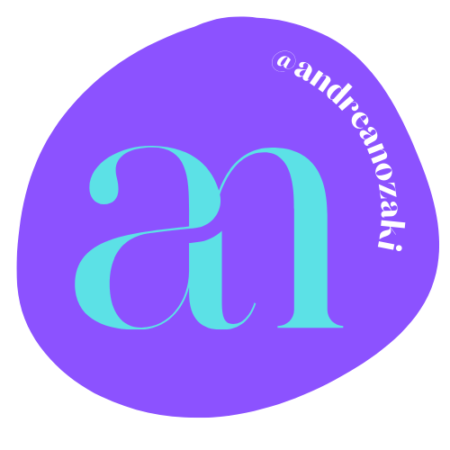

<h1>Hi There! 👋</h1>
 
 <h2>Meu nome é Andrea Nozaki 😃</h2>

 

- (React JS | Javascript | HTML | CSS | Git | Github | Scrum ) 🚀 

- 🎓 Software Engineer Student

- I love building tech and learning new technologies. Minha especialização envolve HTML, CSS, JavaScript (JS) e estou atualmente me dedicando ao aprendizado de React.js.   Sempre estou em busca de melhorar minhas habilidades e meu foco é criar sistemas escaláveis e de fácil manutenção.

     
        

